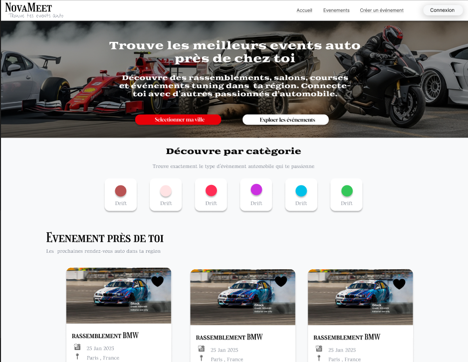

# Novameet

Novameet est une application web permettant aux utilisateurs de créer, gérer et découvrir des événements.  
L’objectif du projet est de faciliter les rencontres autour d’activités en rendant la création et la recherche d’événements simple, rapide et intuitive.

---

## 🚀 Fonctionnalités

### Fonctionnalités actuelles
- Création d’événements  
- Consultation des événements  
- Page profil utilisateur  
- Inscription et connexion  
- Interface simple et intuitive

### Fonctionnalités prévues (évolutions)
- Ajout d’un système de favoris  
- Suppression d’événements et d’utilisateurs  
- Géolocalisation automatique de la ville  
- Cookie de connexion persistante (éviter de se reconnecter à chaque fois)  
- Simplification du formulaire de création d’événements  

---

## 📂 Structure du projet

```

projet/
├─
├─ public/
├─ src/
│  ├─ components/
│  ├─ pages/
│  ├─ services/
│  ├─ styles/
│  ├─ App.js
│  └─ main.js
├─ package.json
└─ README.md


## 🛠️ Technologies utilisées

- JavaScript  
- Framework frontend (React / Vue) – adapter selon ton choix  
- Node.js  
- Backend Express (si utilisé)  
- Base de données (MongoDB / MySQL selon ta configuration)  
- CSS / Tailwind / autre framework

---

## 📦 Installation

### 1. Cloner le projet
```bash
git clone https://github.com/mon-compte/novameet.git
````

### 2. Installer les dépendances

```bash
npm install
```

### 3. Lancer le projet

```bash
npm run start
```

### 4. pour avoir les mise a jour du visuel 

```bash
npm run watch
```

---

## 📘 Documentation

### 1. Documentation du projet

La documentation décrit le fonctionnement global de Novameet : architecture, choix techniques, logique générale, organisation du code.

### 2. Documentation technique

Inclut :

* La structure des dossiers
* Les modèles de données
* Les routes (API ou frontend)
* Les composants importants
* Les dépendances principales

Objectif : faciliter la maintenance et l’évolution du projet.

### 3. Documentation utilisateur

Explique comment utiliser Novameet :

* Créer un compte
* Se connecter
* Naviguer dans l’interface
* Créer un événement
* Voir les événements disponibles
* Modifier son profil

### 4. README.md

Ce fichier sert de point d’entrée rapide pour comprendre le projet et savoir comment le lancer.

---

## 🔮 Perspectives d’évolution

* Mise en place du système de favoris
* Ajout de la suppression d’événements et d’utilisateurs
* Intégration de la géolocalisation
* Cookie de connexion persistante
* Simplification du formulaire de création d’événement

---

## 📄 Licence

À compléter selon ton choix (MIT, Apache 2.0, etc.)

---

## 👤 Auteur

Nina – Étudiante en développement web et web mobile.


